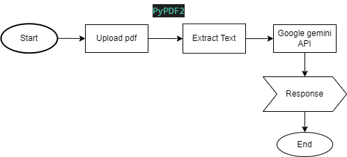

# Smart ATS Resume Analyzer

Smart ATS Resume Analyzer is a tool designed to enhance resume submissions by analyzing them against specific job descriptions. Utilizing advanced machine learning models through the GenAI API, this application provides feedback on how well a resume matches a job description and suggests improvements.

### Technology Stack

- Python 3.9.5
- GenAI API (Gemini Model)
- PyPDF2
- Streamlit
- Black formatter

The step by step process of completion of this project is given below:

### 1. Clone the Repository

Clone this repository to your local machine using the following command:

 `python -m venv env`

 `.\env\Scripts\activate`

### 2. Install Required Packages
Install the necessary Python packages:

 `pip install -r requirements.txt`

### 3. Configuration

Create a config.yaml file in the root directory and add your GenAI API key. It reads the API key needed for making authenticated requests to an external API. The API key is stored in a Python dictionary (config) and is used to configure the external API client.

### 4. PDF Text Extraction

This function takes an uploaded PDF file and extracts all the text from it. It uses pdf.PdfReader to read the PDF file, iterates over all the pages, and appends the extracted text to a string which it returns. This text is then used to match against job descriptions.

### 5. Content Generation with Gemini Model

This function sends an input string to the Gemini Pro model of the GenAI API, which generates content based on the input. The model is likely configured to provide intelligent responses suitable for ATS purposes, such as evaluating resumes against job descriptions.

### 6. Streamlit Web App

The final part of the code uses Streamlit to create a simple web interface. It allows users to paste a job description, upload their resume as a PDF, and submit it for analysis. If the "Submit" button is clicked and a file is uploaded, the application processes the uploaded resume, sends it along with the job description to the Gemini model, and displays the model's response on the web page.

